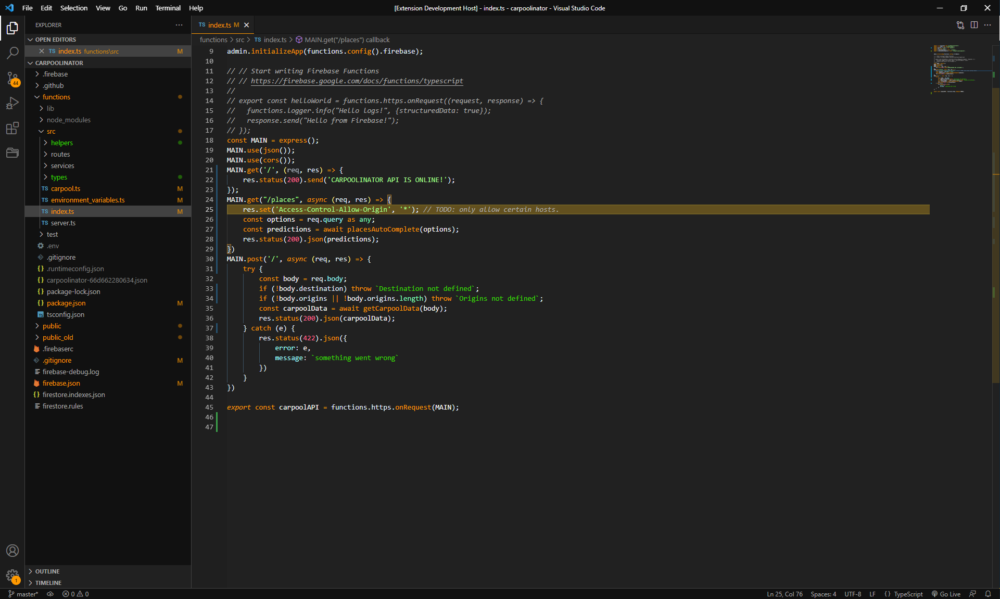

# Halloween Theme

### This theme is heavily inspried by Wes Bos' Cobalt 2 Theme. I basically just changed a few colors around to make it spooky. Check out his theme here => https://marketplace.visualstudio.com/items?itemName=wesbos.theme-cobalt2




## Recommended Settings by Wes Bos
```js
{
  "workbench.colorTheme": "Halloween",
  // The Cursive font is operator Mono, it's $200 and you need to buy it to get the cursive
  "editor.fontFamily": "Operator Mono, Menlo, Monaco, 'Courier New', monospace",
  "editor.fontSize": 17,
  "editor.lineHeight": 25,
  "editor.letterSpacing": 0.5,
  "files.trimTrailingWhitespace": true,
  "editor.fontWeight": "400",
  "prettier.eslintIntegration": true,
  "editor.cursorStyle": "line",
  "editor.cursorWidth": 5,
  "editor.cursorBlinking": "solid",
  "editor.renderWhitespace": "all",
}
```